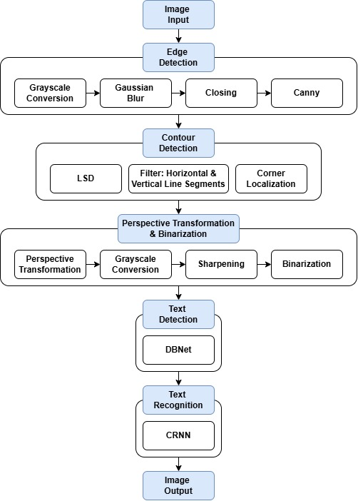

# Document OCR
## About the Project
This project is part of the SJTU ICE4309 - Image Processing & Content Analysis course. We implemented an OCR framework for converting in-the-wild documents to digitally readable and recognizable text.

## Features
The model architecture of Document OCR is shown below: 

<div style="text-align: center;">
  
</div>

- The images undergo **preprocessing**, including **edge detection, contour detection, perspective transformation and binarization** to further enhance the image.
- The **text detection** module uses the **DBNet** model with **MobileNetV3** as the backbone network.
- The **text recognition** module uses the **CRNN** model with **MobileNetV3** as the backbone network.

## Getting Started
To get started with your project, follow the steps below to set up your environment, install the necessary dependencies.
#### Create and activate new conda environment
```bash
conda create -n ocr python=3.9
conda activate ocr
```

#### Install pip requirements
```bash
pip install -r requirements.txt
```

## Usage
#### Run the script
```bash
python run.py --img <IMG_DIR> --preprocess 
```
Replace `<IMG_DIR>` with the path to a single image. Specify `--preprocess` to preprocess the input image

#### Example
```bash
python run.py --img input_img/receipt.jpg --preprocess
```

## Acknowledgements
